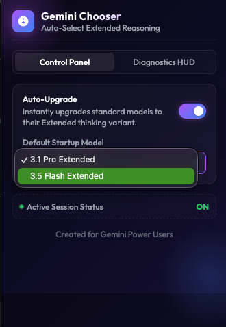
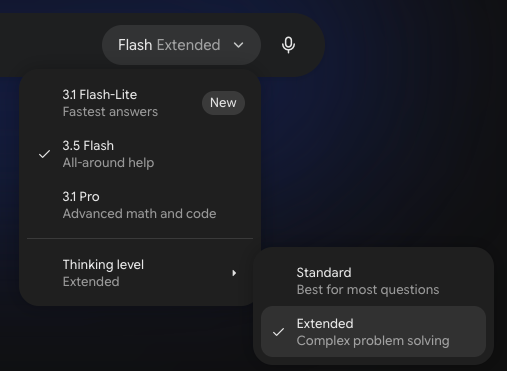
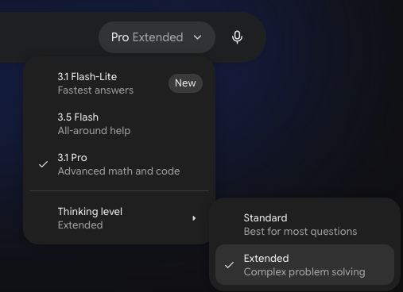

<div align="center">

# ⚡ Gemini Chooser — Auto Extended Reasoning

### *Say goodbye to manual clicks. Seamlessly default to Gemini's Pro & Flash "Extended" thinking models in your browser.*

<p align="center">
  
</p>

[](manifest.json)
[](CHROMEWEBSTORE.md)
[](LICENSE)
[](#)

---

<h3>
  <a href="#-why-this-is-necessary">The Problem</a> •
  <a href="#-visual-showcase">Visual Showcase</a> •
  <a href="#-features">Features</a> •
  <a href="#-how-to-install">Installation</a> •
  <a href="#-diagnostics--customization">HUD Panel</a> •
  <a href="#-license">License</a>
</h3>

</div>

---

## 💡 The Problem (Why This Is Necessary)

Google Gemini's web interface defaults to standard reasoning models to save server compute tokens. **Every single time you open a new chat session or toggle between Pro and Flash models, you are forced to go into the sub-menu and click "Extended" again.**

For developers, power users, and researchers, this is a tedious hurdle. **Gemini Chooser** automates this selection in real-time, routing your queries to the highest-fidelity reasoning and chain-of-thought models by default, and immediately returning focus to the text input box so you can start typing without missing a beat.

---

## 📸 Visual Showcase

<table align="center" width="100%" border="0" cellspacing="0" cellpadding="10">
  <tr>
    <td align="center" valign="top" width="45%" style="border: none;">
      <strong>🔮 Premium Control Panel</strong>
      <p align="center">
        <em>Glassmorphic dark-mode settings panel with auto-upgrade toggles, default model startup selectors, and real-time session status trackers.</em>
      </p>
      
    </td>
    <td align="center" valign="top" width="55%" style="border: none;">
      <strong>⚡ Intelligent Selection Automation</strong>
      <p align="center">
        <em>Watch the extension automatically intercept the Gemini menu selections and instantly toggle the "Extended" reasoning submenu in the background.</em>
      </p>
      
      <br/>
      
    </td>
  </tr>
</table>

---

## ✨ Features

- ⚡ **Zero-Click Upgrades**: Instantly detects and upgrades your model to the "Extended" variant upon loading the app or changing active models.
- 🎯 **Automatic Cursor Recovery**: Immediately shifts cursor focus and places it back in the Gemini chat input box after switching models, letting you type instantly.
- 🎨 **Glassmorphic Options UI**: An elegant, premium dark-mode interface built using modern CSS, dynamic HSL colors, responsive hover states, and smooth toggle animations.
- 🔍 **Integrated Diagnostics HUD**: A real-time developer DOM parser inside the popup that scans active page elements, evaluates CSS selectors, and outputs clean reports if Google updates their UI.
- 🛡️ **Resilient Accessibility-First Selectors**: Built using semantic ARIA heuristics (`role="button"`, `aria-label`) and textual matches to withstand Google's frequent CSS container hash mutations.
- 🔒 **Lightweight & Privacy-First**: 100% local operation. Zero third-party trackers, zero analytical scripts, and zero network requests.

---

## 🛠️ How to Install (Simple Install Guide)

Loading Gemini Chooser as an unpacked developer extension takes less than a minute:

### Step 1: Clone the Repository
Clone this clean, anonymized repository to your local system:
```bash
git clone https://github.com/ihearttokyo/gemini-chooser.git
```
*(Or download this repository as a ZIP archive and extract it to a directory on your machine).*

### Step 2: Open Chrome Extensions
In your Google Chrome (or Chromium-based) browser, navigate to the extension manager:
```text
chrome://extensions/
```

### Step 3: Enable Developer Mode
Turn the **"Developer mode"** toggle in the **top-right corner** of the page to **ON**.

### Step 4: Load the Unpacked Folder
1. Click the **"Load unpacked"** button in the **top-left corner**.
2. Select the `Gemini Chooser` root directory (containing `manifest.json`).

### Step 5: Start Reasoning!
Navigate to [gemini.google.com/app](https://gemini.google.com/app) and open the Gemini Chooser options from your toolbar to set your preferences. The extension handles the rest!

---

## ⚙️ HUD Panel & DOM Diagnostics

The **Diagnostics HUD** is a specialized tool engineered directly into the extension's toolbar popup. It serves as a real-time monitor and testing suite:

1. **Auto-Scan**: Performs live DOM querying on the active Gemini tab.
2. **Visual Status Check**: Shows whether the active model button, dropdowns, and submenus are visible.
3. **CSS Selector Path Logs**: Lists all candidate buttons and class paths discovered on the page.
4. **Troubleshoot Exporter**: Offers a **"Copy Debug Report"** option so developers can immediately inspect structural DOM updates if Google releases a site change.

---

## 📄 License

This project is fully open-source and released under the [MIT License](LICENSE).
